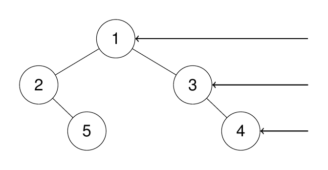

### Binary Tree Right Side View (medium)

> https://leetcode.com/problems/binary-tree-right-side-view/description/

Given the `root` of a binary tree, imagine yourself standing on the **right side** of it, return _the values of the nodes you can see ordered from top to bottom_.

##### Example1:

> **Input:** `root = [1,2,3,null,5,null,4]`.
> **Output:** `[1,3,4]`.
> Explanation:
> 

##### Example2:

> **Input:** `root = [1,2,3,4,null,null,null,5]`.
> **Output:** `[1,3,4,5]`.
> Explanation:
> 

##### Example3:

> **Input:** `root = [1,null,3]`.
> **Output:** `[1,3]`.

##### Example4:

> **Input:** `root = []`.
> **Output:** `[]`.

##### Constraints:

- The number of nodes in the tree is in the range `[0, 100]`.
- `-100 <= Node.val <= 100`
